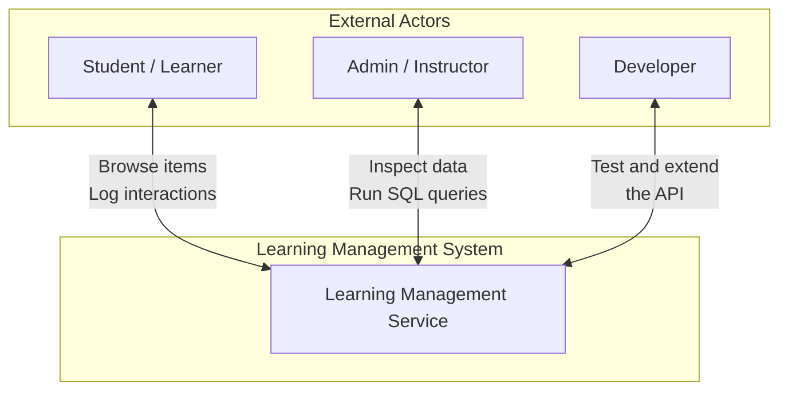
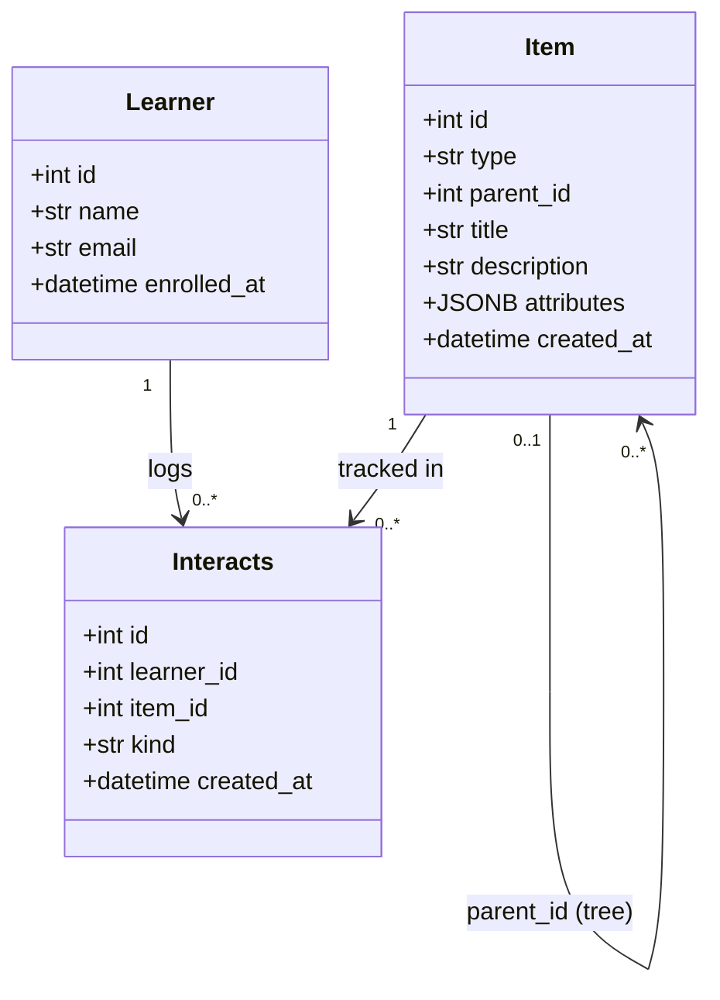
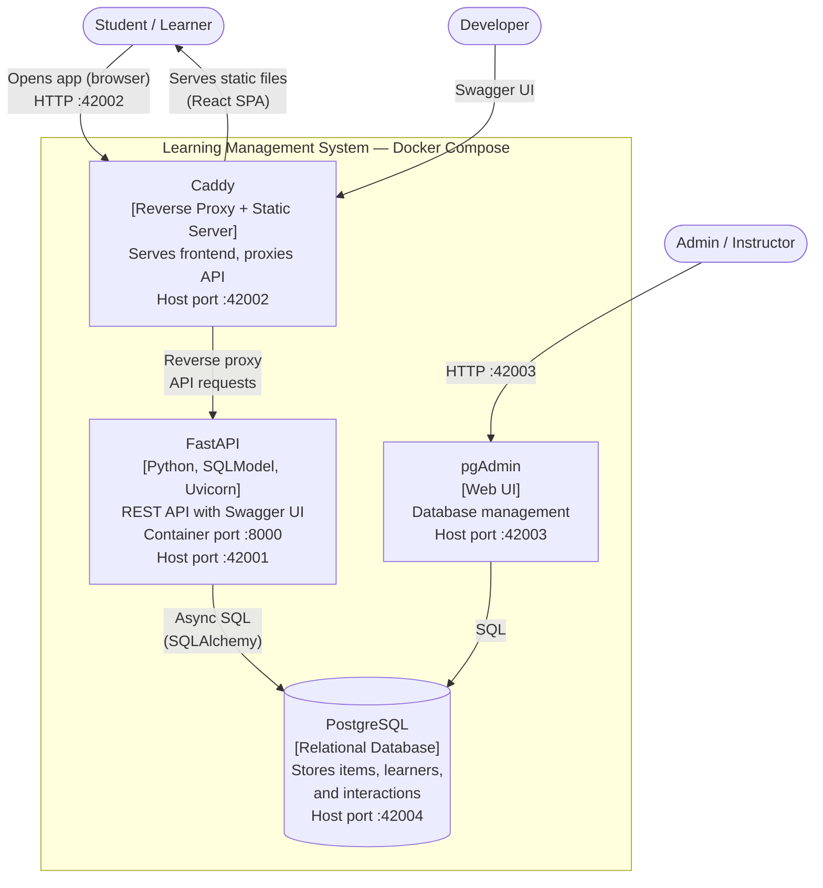
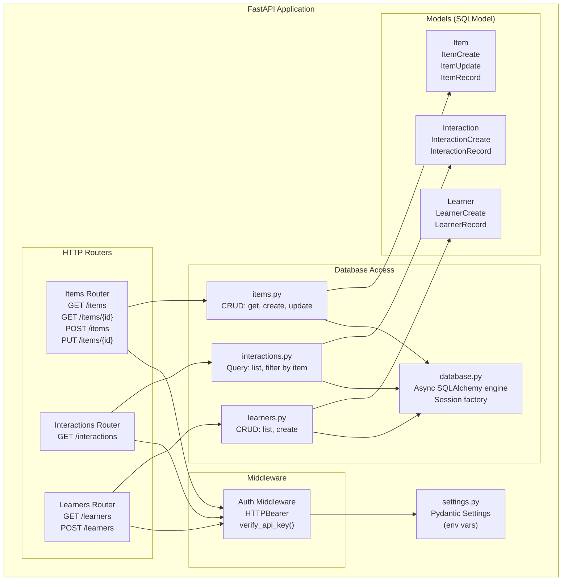
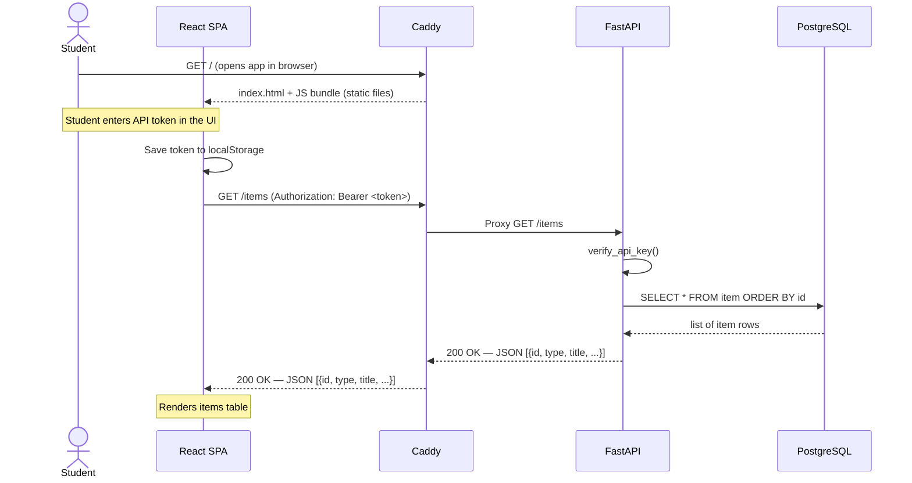
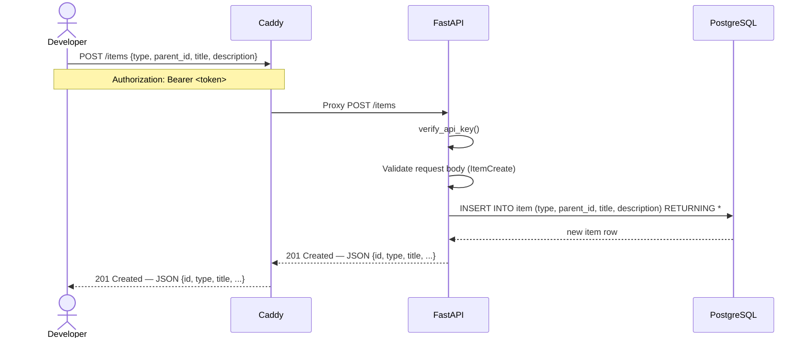
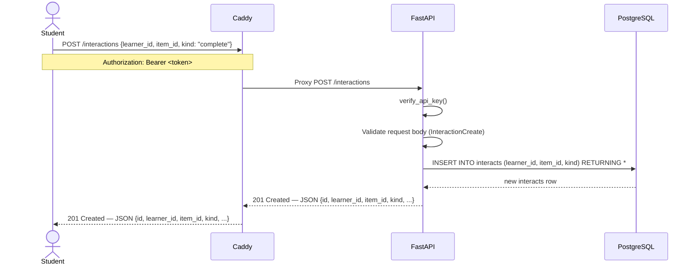

# Learning Management Service — Architecture Document

## Table of Contents

- [Table of Contents](#table-of-contents)
- [1. Introduction](#1-introduction)
- [2. Context Diagram](#2-context-diagram)
  - [External Actors](#external-actors)
- [3. Domain Model](#3-domain-model)
  - [Entity Descriptions](#entity-descriptions)
  - [Key Relationships](#key-relationships)
- [4. Container Diagram](#4-container-diagram)
  - [Container Responsibilities](#container-responsibilities)
- [5. Component Diagram](#5-component-diagram)
  - [5.1 FastAPI Application](#51-fastapi-application)
    - [Component Descriptions](#component-descriptions)
- [6. Sequence Diagrams](#6-sequence-diagrams)
  - [6.1 Student Fetches Items via Frontend](#61-student-fetches-items-via-frontend)
  - [6.2 Developer Creates a Learning Item](#62-developer-creates-a-learning-item)
  - [6.3 Student Logs an Interaction](#63-student-logs-an-interaction)
- [7. Design Decisions](#7-design-decisions)
  - [7.1 Architecture Pattern — Monolith with Layered Structure](#71-architecture-pattern--monolith-with-layered-structure)
  - [7.2 Reverse Proxy + Static Server — Caddy](#72-reverse-proxy--static-server--caddy)
  - [7.3 ORM — SQLModel (SQLAlchemy + Pydantic)](#73-orm--sqlmodel-sqlalchemy--pydantic)
  - [7.4 Feature Flags for Optional Endpoints](#74-feature-flags-for-optional-endpoints)
  - [7.5 Async Database Access](#75-async-database-access)
  - [7.6 OBER-Compatible Data Schema](#76-ober-compatible-data-schema)

---

## 1. Introduction

This document describes the architecture of the **Learning Management Service (LMS)** — the system students deploy, test, and extend in the Software Engineering Toolkit labs.

The architecture follows the **C4 model**, progressing from a high-level system context (what it is and who uses it) down to containers (how it is deployed), components (how the code is structured), and interaction flows (how the pieces work together at runtime).

The data model is grounded in **OBER** (Outcome-Based Educational Recommender): items can *promote* or *verify* learning outcomes, and learner interactions are logged so that outcome mastery can be calculated from those logs.

---

## 2. Context Diagram

The context diagram shows the system boundary and the external actors that interact with it.

### External Actors

| Actor              | Description                                                                                   |
| ------------------ | --------------------------------------------------------------------------------------------- |
| Student / Learner  | Uses the React frontend to browse learning items; interaction events are logged automatically |
| Admin / Instructor | Manages the database via pgAdmin; validates API responses via Swagger UI                      |
| Developer          | Writes unit and end-to-end tests; extends the system as part of lab exercises                 |

---

## 3. Domain Model

The domain model is based on OBER: it extends the classic *Learner–Item* schema with a hierarchy for learning content and a log of interactions.

### Entity Descriptions

| Entity      | Description                                                                                                                                                                                   |
| ----------- | --------------------------------------------------------------------------------------------------------------------------------------------------------------------------------------------- |
| `Item`      | Any piece of learning content. Forms a tree via `parent_id`. `type` is one of: `course`, `lab`, `task`, `step`. `attributes` holds type-specific metadata (e.g. instructors, dates) as JSONB. |
| `Learner`   | A student enrolled in the system. Identified by email (unique).                                                                                                                               |
| `Interacts` | One interaction event: a learner engaging with an item. `kind` is one of: `view`, `attempt`, `complete`.                                                                                      |

### Key Relationships

- **Item tree**: Items reference a `parent_id` forming a four-level hierarchy — `course → lab → task → step`. Root items have `parent_id = NULL`.
- **Interaction log**: Every `Interacts` record links one `Learner` to one `Item` with a `kind` (what happened) and a timestamp (when).
- **OBER extension point**: Items carry a `type` and `attributes` that can express whether an item *promotes* (teaches) or *verifies* (assesses) a learning outcome — enabling mastery calculation from the interaction log.

---

## 4. Container Diagram

The system is deployed as four Docker containers, orchestrated by Docker Compose. The React frontend is compiled into static files and served by Caddy.

### Container Responsibilities

| Container  | Technology                         | Responsibility                                                                                                                                                                                                                                             |
| ---------- | ---------------------------------- | ---------------------------------------------------------------------------------------------------------------------------------------------------------------------------------------------------------------------------------------------------------- |
| Caddy      | Go, Caddyfile, Node (build stage)  | Serves the React frontend as static files at `/` and reverse-proxies API paths (`/items`, `/learners`, `/interactions`, `/docs`) to FastAPI. Built via a multi-stage Dockerfile that compiles the TypeScript frontend and bundles it into the Caddy image. |
| FastAPI    | Python, FastAPI, SQLModel, Uvicorn | REST API: handles all business logic, validates Bearer token on every request, and exposes auto-generated Swagger UI at `/docs`.                                                                                                                           |
| PostgreSQL | PostgreSQL                         | Relational database: stores the `item`, `learner`, and `interacts` tables. Initialised with schema and seed data from `init.sql` on first startup.                                                                                                         |
| pgAdmin    | pgAdmin 4                          | Web-based database management UI: lets admins inspect tables, run SQL queries, and browse the data.                                                                                                                                                        |

---

## 5. Component Diagram

### 5.1 FastAPI Application

The FastAPI application is structured into four layers: HTTP routers, middleware, database access, and data models.

#### Component Descriptions

| Component           | File                      | Description                                                                                                      |
| ------------------- | ------------------------- | ---------------------------------------------------------------------------------------------------------------- |
| Items Router        | `routers/items.py`        | CRUD endpoints for learning items. Always enabled.                                                               |
| Interactions Router | `routers/interactions.py` | Read endpoints for interaction logs. Enabled via `ENABLE_INTERACTIONS=true`.                                     |
| Learners Router     | `routers/learners.py`     | CRUD endpoints for learner profiles. Enabled via `ENABLE_LEARNERS=true`.                                         |
| Auth Middleware     | `auth.py`                 | Validates the `Authorization: Bearer <token>` header on every request. Token configured via `API_TOKEN` env var. |
| Items DB            | `db/items.py`             | Async database operations for the `item` table.                                                                  |
| Interactions DB     | `db/interactions.py`      | Async database operations for the `interacts` table.                                                             |
| Learners DB         | `db/learners.py`          | Async database operations for the `learner` table.                                                               |
| Database Connection | `database.py`             | Creates and manages the async SQLAlchemy engine and session factory.                                             |
| Models              | `models/`                 | SQLModel classes: define table schema, validate input (Pydantic), and shape API responses.                       |
| Settings            | `settings.py`             | Pydantic `BaseSettings`: reads all configuration from environment variables.                                     |

---

## 6. Sequence Diagrams

### 6.1 Student Fetches Items via Frontend

The most common interaction: a student opens the browser, Caddy serves the React SPA as static files, and the SPA calls the API through Caddy. The API token is entered at runtime through the UI and persisted in `localStorage`.

### 6.2 Developer Creates a Learning Item

A developer (or test) sends a POST request to add a new item to the hierarchy.

### 6.3 Student Logs an Interaction

A learner completes an item; the event is recorded in the interaction log.

---

## 7. Design Decisions

### 7.1 Architecture Pattern — Monolith with Layered Structure

**Decision:** The backend is a single FastAPI application with a layered structure (routers → database access → models), not a microservices architecture.

**Rationale:** The system is small and pedagogical. A monolith is easier to deploy, test, and understand. Students can read the entire codebase in one sitting.

**Trade-off:** Vertical scaling only; not suitable for high load without redesign.

---

### 7.2 Reverse Proxy + Static Server — Caddy

**Decision:** Caddy serves the built React SPA as static files at `/` and reverse-proxies API paths (`/items`, `/learners`, `/interactions`, `/docs`) to FastAPI.

**Rationale:** A single-origin setup eliminates CORS configuration and simplifies the frontend — the SPA uses relative paths instead of an absolute API URL. Caddy also handles TLS termination and port decoupling. The frontend is compiled in a multi-stage Dockerfile (`frontend/Dockerfile`): Node builds the TypeScript bundle, then the output is copied into the Caddy image.

**Configuration:** `CADDY_CONTAINER_PORT` (external) → `APP_CONTAINER_PORT` (FastAPI). Defaults: `42002` → `8000`.

---

### 7.3 ORM — SQLModel (SQLAlchemy + Pydantic)

**Decision:** SQLModel is used for both database table definitions and API request/response validation.

**Rationale:** SQLModel combines SQLAlchemy (ORM, async queries) and Pydantic (data validation, serialisation) in a single class hierarchy. This avoids duplicating model definitions and keeps the codebase concise for a teaching context.

---

### 7.4 Feature Flags for Optional Endpoints

**Decision:** The interactions and learners routers are conditionally included based on environment variables (`ENABLE_INTERACTIONS`, `ENABLE_LEARNERS`).

**Rationale:** Students implement parts of the API incrementally across labs. Feature flags let the instructor control which endpoints are active without changing code.

---

### 7.5 Async Database Access

**Decision:** The application uses `asyncpg` and SQLAlchemy's async engine for all database operations.

**Rationale:** FastAPI is built on async Python (ASGI). Using async database drivers avoids blocking the event loop and is consistent with the framework's model. It also exposes students to async/await patterns.

---

### 7.6 OBER-Compatible Data Schema

**Decision:** The `item` table uses a self-referential `parent_id` and a `type` column to model the content hierarchy. The `attributes` column is JSONB for type-specific metadata.

**Rationale:** This schema is minimal but expressive. It maps directly to the OBER entity model (Item → Outcome via `aligns`), where `type` can distinguish *promoting* from *verifying* items. JSONB attributes avoid the need to normalise type-specific fields into separate tables.
