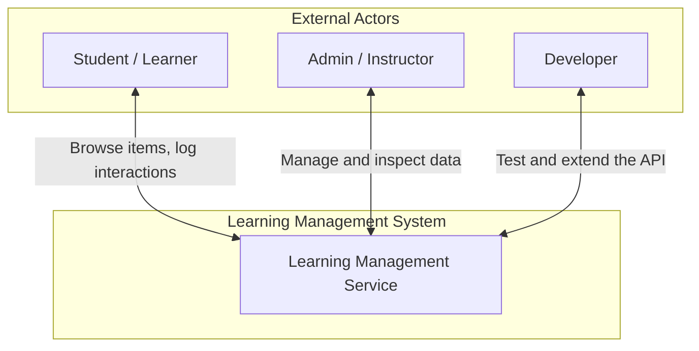

# Learning Management Service — Vision

## 1. Introduction

The Learning Management Service (LMS) is a backend API system built for the Software Engineering Toolkit course at Innopolis University. It is grounded in the **OBER** (Outcome-Based Educational Recommender) framework, which places learning outcomes at the center of the system — enabling evaluation of learning trajectories based on actual mastery rather than engagement metrics alone.

Students interact with the LMS throughout the course labs: they deploy it, test it, extend it with a front-end, and use it as the subject of software engineering exercises.

## 2. Business Context

- Learning content is organized as a hierarchy: courses contain labs, labs contain tasks, tasks contain steps.
- Learner interactions (views, attempts, completions) are recorded against items to track progress.
- The data schema follows OBER: items can *promote* or *verify* learning outcomes, and mastery is calculated from interaction logs.
- The system serves as the hands-on subject of lab exercises in testing, deployment, front-end development, and AI-assisted coding.

## 3. Vision of the Solution

### 3.1 Vision Statement

> Provide a deployable, testable REST API that models learning content hierarchically, records learner interactions, and lays the foundation for outcome-based assessment — serving as the practical subject of the Software Engineering Toolkit lab exercises.

### 3.2 Main Features

| ID  | Feature                  | Description                                                               |
| --- | ------------------------ | ------------------------------------------------------------------------- |
| F1  | Learning item tree       | Store items in a four-level hierarchy: course → lab → task → step         |
| F2  | Item CRUD                | Create, read, and update items via REST endpoints                         |
| F3  | Interaction logging      | Record learner interactions (view, attempt, complete) against items       |
| F4  | Learner management       | Manage learner profiles: name, email, enrollment date                     |
| F5  | Bearer token auth        | Authenticate all API requests with a configurable Bearer token            |
| F6  | Swagger UI               | Auto-generated interactive API documentation at `/docs`                   |
| F7  | React front-end          | Browser SPA that fetches and displays the item list                       |
| F8  | Reverse proxy            | Caddy routes external HTTP traffic to the API                             |
| F9  | Database admin UI        | pgAdmin provides a web interface for inspecting and querying the database |
| F10 | Containerised deployment | Docker Compose orchestrates all services for local and VM deployment      |

## 4. Scope

**In scope:**

- REST API for items, interactions, and learners
- PostgreSQL data store with seed data
- React frontend displaying the item list
- Caddy reverse proxy routing external traffic to the API
- pgAdmin for database management
- Docker Compose orchestration

**Out of scope (data model supports it; not yet implemented):**

- Outcome mastery calculation and recommendation engine
- Learner self-registration and authentication
- Outcome tree management via API

## 5. System Context

## 6. External Actors

| Actor              | Description                                                                        |
| ------------------ | ---------------------------------------------------------------------------------- |
| Student / Learner  | Uses the frontend to browse learning items and logs interactions as they study     |
| Admin / Instructor | Inspects the database via pgAdmin; validates data via Swagger UI                   |
| Developer          | Writes and runs tests against the API; extends the system as part of lab exercises |

## 7. Quality Attributes

### Deployability

The system must be startable with a single command (`docker compose up`) on a fresh Linux VM without manual configuration beyond setting environment variables.

### Testability

The API must be fully testable via unit tests (business logic in isolation) and end-to-end tests (HTTP requests against a running instance). Intentional bugs are present for students to discover through testing.

### Maintainability

The codebase must be readable and modifiable by students with basic Python and TypeScript knowledge, following familiar patterns (FastAPI routers, SQLModel, React functional components).

### Security

All API endpoints must be protected with Bearer token authentication. No endpoint is accessible without a valid token.
