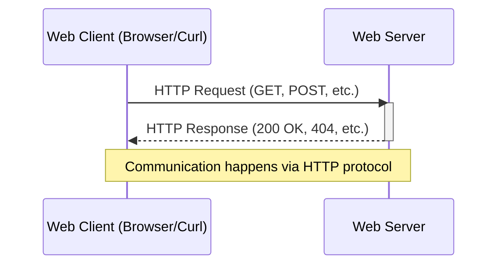

# Web development

- [Web server and web client](#web-server-and-web-client)
  - [Web server](#web-server)
  - [Web client](#web-client)
- [Protocol](#protocol)
- [`HTTP`](#http)
  - [Communication using `HTTP`](#communication-using-http)
  - [`HTTP` request](#http-request)
    - [Query parameter](#query-parameter)
  - [`HTTP` response](#http-response)
  - [`HTTP` response status code](#http-response-status-code)
  - [Common `HTTP` response status codes](#common-http-response-status-codes)
- [Data format](#data-format)
  - [`JSON`](#json)
    - [`JSON` data types](#json-data-types)
    - [Example of `JSON` data](#example-of-json-data)
  - [`Protobuf`](#protobuf)
- [API](#api)
- [Endpoint](#endpoint)
- [Send a `GET` query](#send-a-get-query)
  - [Send a `GET` query using a browser](#send-a-get-query-using-a-browser)
  - [Send a `GET` query using curl](#send-a-get-query-using-curl)
- [Pretty-print the `JSON` response](#pretty-print-the-json-response)
  - [Pretty-print the `JSON` response using `jq`](#pretty-print-the-json-response-using-jq)
  - [Pretty-print the `JSON` response using a browser](#pretty-print-the-json-response-using-a-browser)
- [URL](#url)
  - [Purpose](#purpose)
  - [Components of a URL](#components-of-a-url)
  - [URL example](#url-example)
- [Service](#service)

## Web server and web client

### Web server

A web server is software that delivers content or services to [web clients](#web-client) over the [Internet](./networks.md#internet) using a [protocol](#protocol).

> [!NOTE]
> We refer to a web server as software only.
>
> Other sources may refer to it as hardware too.
>
> Example: [What is a web server](https://developer.mozilla.org/en-US/docs/Learn_web_development/Howto/Web_mechanics/What_is_a_web_server).

### Web client

A web client is software that requests content from a [web server](#web-server) and displays the received content.

Web clients include browsers (`Chrome`, `Firefox`) and command-line tools ([`curl`](#send-a-get-query-using-curl)).

## Protocol

A protocol is a set of rules that define how data is transmitted and received over a network. In web development, protocols govern communication between [web servers and web clients](#web-server-and-web-client).

## `HTTP`

`HTTP` (`HyperText Transfer Protocol`) is the foundation of data communication on the web. This [protocol](#protocol) defines how messages are formatted and transmitted between [web servers and web clients](#web-server-and-web-client).

### Communication using `HTTP`

The following diagram illustrates the communication between a [web client](#web-client) and [web server](#web-server) using the `HTTP` protocol:



### `HTTP` request

An `HTTP` request is a message sent by a client to a server asking for resources or to perform actions. It includes a method, headers, and optional body.

#### Query parameter

Query parameters are key-value pairs appended to a [URL](#url) after a `?` character, used to send data to the server with a request.

### `HTTP` response

An `HTTP` response is the server's answer to an `HTTP` request, containing status information and requested content.

### `HTTP` response status code

Status codes are three-digit numbers returned by servers indicating the result of a request (success, error, redirect, etc.).

### Common `HTTP` response status codes

Standard status codes include:

- [`200` (OK)](https://developer.mozilla.org/en-US/docs/Web/HTTP/Reference/Status/200)
- [`404` (Not Found)](https://developer.mozilla.org/en-US/docs/Web/HTTP/Reference/Status/404)
- [`500` (Internal Server Error)](https://developer.mozilla.org/en-US/docs/Web/HTTP/Reference/Status/500)

## Data format

### `JSON`

`JSON` (`JavaScript Object Notation`) is a lightweight, text-based data interchange format that is easy for humans to read and write, and easy for machines to parse and generate.

It is language-independent but derived from `JavaScript` and commonly used in web applications to transmit data between a [server and a client](#web-server-and-web-client).

See [Learn `JSON` in Y minutes](https://learnxinyminutes.com/json/).

#### `JSON` data types

`JSON` supports basic data types like strings, numbers, booleans, arrays, and objects, making it ideal for representing structured data. Its simplicity and compatibility with most programming languages have made it the de facto standard for API responses and configuration files.

#### Example of `JSON` data

```json
{
  "name": "John Doe",
  "age": 35,
  "active": true,
  "skills": ["Python", "JavaScript", "Go"]
}
```

### `Protobuf`

`Protobuf` (`Protocol Buffers`) is a binary serialization format developed by `Google` for structured data exchange between applications. It's a language-neutral, platform-neutral mechanism for serializing structured data, similar to `XML` or `JSON` but more compact and faster.

`Protobuf` uses `.proto` files to define data structures, which are then compiled into language-specific classes for various programming languages. It's commonly used in microservices architectures and API communications where efficiency and schema evolution are important.

## API

## Endpoint

An endpoint is a specific API entry point identified by:

- HTTP method (`GET`, `POST`, `PUT`, `DELETE`, ...).
- Path (`/status`, `/items`, ...).

Example:

- `GET /status` is one endpoint.
- `POST /status` is a different endpoint.

Quick check with `curl`:

```terminal
curl http://127.0.0.1:42000/status
```

## Send a `GET` query

### Send a `GET` query using a browser

### Send a `GET` query using curl

## Pretty-print the `JSON` response

### Pretty-print the `JSON` response using `jq`

1. [Install `jq`](./linux.md#install-jq) if not installed.
2. [Run using the `VS Code Terminal`](./vs-code.md#run-a-command-using-the-vs-code-terminal):

   ```terminal
   <command-that-produces-json-response> | jq .
   ```

   [Pipe the output](./linux.md#pipe) to `jq`.

Example:

```terminal
curl -s https://jsonplaceholder.typicode.com/todos/1 | jq .
```

### Pretty-print the `JSON` response using a browser

`Chrome`:

1. click `Pretty-print`.

`Firefox`:

1. Click `Raw Data`
2. Clik `Pretty Print`

<!-- TODO other browsers -->

## URL

A URL (`Uniform Resource Locator`) is a reference or address used to identify and locate resources on the Internet. It's commonly known as a "web address" and specifies the location of a resource on a web server as well as the protocol used to access it.

### Purpose

URLs are used by web browsers and other applications to retrieve resources like web pages, images, videos, and API endpoints. They provide a standardized way to locate and access resources across the Internet.

### Components of a URL

A typical URL consists of several components:

- **Scheme/Protocol**: Specifies how to access the resource (e.g., `http`, `https`, `ftp`).
- **Host/Domain**: The server where the resource is located (e.g., `www.example.com`).
- **Port** (optional): The specific port number on the server (e.g., `:8080`).
- **Path**: The location of the specific resource on the server (e.g., `/folder/page.html`).
- **Query parameters** (optional): Additional data passed to the server (e.g., `?param1=value1&param2=value2`).
- **Fragment** (optional): Points to a specific section within the resource (e.g., `#section1`).

### URL example

```text
https://www.example.com:8080/search?q=cats&page=1#results
```

Where:

- Scheme: `https`
- Host: `www.example.com`
- Port: `8080`
- Path: `/search`
- Query: `?q=cats&page=1`
- Fragment: `#results`

## Service

A service is an application (or part of a system) that exposes endpoints and performs a focused responsibility.

Examples:

- Course materials service.
- Authentication service.
- Recommendation service.

A service can call other services over the network, but to the client it still appears as endpoints that return responses.
