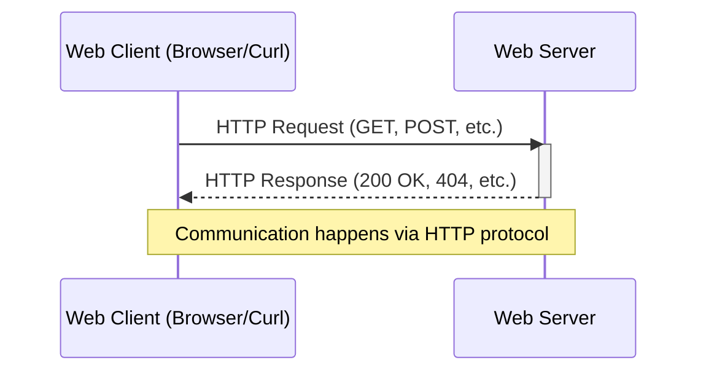

# `HTTP`

<h2>Table of contents</h2>

- [What is `HTTP`](#what-is-http)
- [Communication using `HTTP`](#communication-using-http)
- [`HTTP` request](#http-request)
  - [`HTTP` method](#http-method)
  - [Query parameter](#query-parameter)
- [`HTTP` response](#http-response)
- [`HTTP` response status code](#http-response-status-code)
- [Common `HTTP` response status codes](#common-http-response-status-codes)
  - [`200` (OK)](#200-ok)
  - [`201` (Created)](#201-created)
  - [`400` (Bad Request)](#400-bad-request)
  - [`401` (Unauthorized)](#401-unauthorized)
  - [`403` (Forbidden)](#403-forbidden)
  - [`404` (Not Found)](#404-not-found)
  - [`422` (Unprocessable Entity)](#422-unprocessable-entity)
  - [`500` (Internal Server Error)](#500-internal-server-error)

## What is `HTTP`

`HTTP` (`HyperText Transfer Protocol`) is the foundation of data communication on the web. This [protocol](./web-development.md#protocol) defines how messages are formatted and transmitted between [web servers and web clients](./web-development.md#web-server-and-web-client).

## Communication using `HTTP`

The following diagram illustrates the communication between a [web client](./web-development.md#web-client) and [web server](./web-development.md#web-server) using the `HTTP` protocol:

## `HTTP` request

An `HTTP` request is a message sent by a client to a server asking for resources or to perform actions. It includes a method, headers, and optional body.

### `HTTP` method

An `HTTP` method is a verb that tells the server what action to perform on a resource.

Common methods:

- `GET` — retrieve a resource.
- `POST` — create a new resource.
- `PUT` — update an existing resource.
- `DELETE` — remove a resource.

### Query parameter

Query parameters are key-value pairs appended to a [URL](./web-development.md#url) after a `?` character, used to send data to the server with a request.

## `HTTP` response

An `HTTP` response is the server's answer to an `HTTP` request, containing status information and requested content.

## `HTTP` response status code

Status codes are three-digit numbers returned by servers indicating the result of a request (success, error, redirect, etc.).

## Common `HTTP` response status codes

### `200` (OK)

[`200` (OK)](https://developer.mozilla.org/en-US/docs/Web/HTTP/Reference/Status/200) — the request succeeded.

### `201` (Created)

[`201` (Created)](https://developer.mozilla.org/en-US/docs/Web/HTTP/Reference/Status/201) — a new resource was created (typically after `POST`).

### `400` (Bad Request)

[`400` (Bad Request)](https://developer.mozilla.org/en-US/docs/Web/HTTP/Reference/Status/400) — the request was malformed.

### `401` (Unauthorized)

[`401` (Unauthorized)](https://developer.mozilla.org/en-US/docs/Web/HTTP/Reference/Status/401) — authentication is required or the credentials are invalid.

### `403` (Forbidden)

[`403` (Forbidden)](https://developer.mozilla.org/en-US/docs/Web/HTTP/Reference/Status/403) — the server understood the request but refuses to authorize it.

### `404` (Not Found)

[`404` (Not Found)](https://developer.mozilla.org/en-US/docs/Web/HTTP/Reference/Status/404) — the requested resource does not exist.

### `422` (Unprocessable Entity)

[`422` (Unprocessable Entity)](https://developer.mozilla.org/en-US/docs/Web/HTTP/Reference/Status/422) — the request was well-formed but had invalid data.

### `500` (Internal Server Error)

[`500` (Internal Server Error)](https://developer.mozilla.org/en-US/docs/Web/HTTP/Reference/Status/500) — an unexpected server error occurred.
